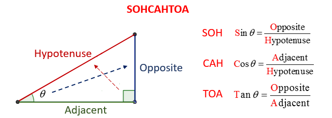
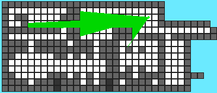
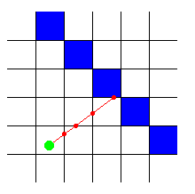
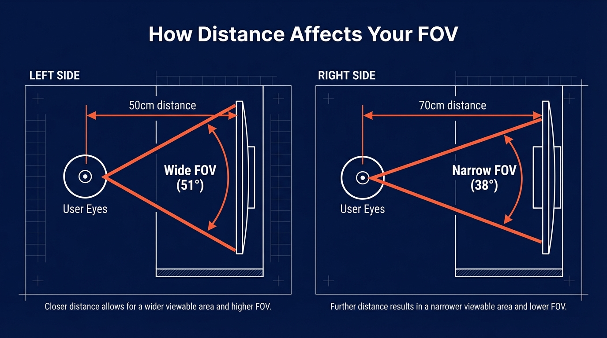
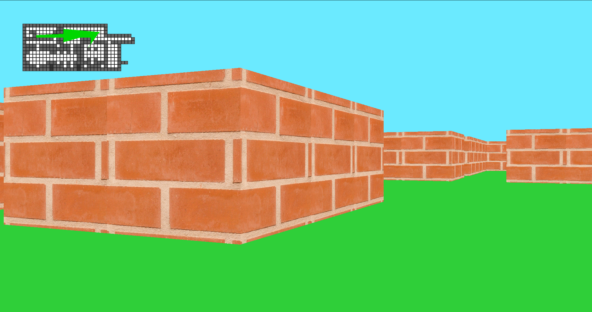

*This project has been created as part
of the 42 curriculum by clouden, dkalgano*

# Description
This project’s objectives are to timetravel back to th 1990's when **Wolfenstein 3D** created a buzz as the first immersive 3D First Person Shooter. We must take of reporoducing the same 3D effects from scratch using a mini version of the **X11** graphics library and **C**.

As a graphic design project, we must demonstrate skills with rendering windows, colors,fill shapes, mapping textures to surfaces. As an interactive FSP, the the player character must be handled with care to activate motion events smoothly and must have solid collision detection in order to sty within the bounds of the walls of the game.

This requires the use of **parsing**, **basic algorithms**, **information research**, **linear algebra** and **trigonometry**.

### Trigonometry

The utility of these functions are the ways that you can derive on of the missing side lengths using these functions.

$$
\sin(\theta) = Opp/Hyp \\
Opp = \sin(\theta) * Hyp \\
Hyp = Opp / \sin(\theta)
$$

So you are able to reformulate these functions to find a missing side of the right triangle. All you need is an angle measurement and the measurement of one side. The important factor is that your angle is tralsated into radians represente by $\theta$.

# Instruction

To get the game running, simply download the repo and compile with `make`. This will create the executable `game` in the root directory. 

>./game assets/basic_map.cub

This executable takes exactly one argument:
- the path of the map asset, a simple text file with `.cub` extension. 

Maps and wall textures maybe added as long as they follow certain criteria in this given order:

- Textures must be `.png` and one path must be indicated for each wall direction: N, S, E,and W (e.g `N path/to/texture.png`). 
- The Floor(F) and Ceiling (C) must be indiacted with 3 comma separated decimal values between 0-255 for RGB channels (e.g. ` F 255,255,255`).

The map must be composed of 0s, 1s, spaces, and one letter indicating player's initial facing position such as N, S, E, or W. 
- the 1s specify walls
- the 0s specify floor
- spaces are non-map zones.

Given that floors are meant to be walked and wall are meant to contain the player, any floor that is open to non-map zones are considered invalid and will not be rendered when executed. This is a strict rule even if player character cannot access the floor that is exposed to a non-map zone.

Exit game with `Ctrl-C`, `Esc`, or closing window normally by clicking the `x` on the window frame.

Move with the standard keys `w`,`s`,`a`,`d` and rotate left or right with `<-` or `->`.

Enjoy!

# Resources
*The following is a brief summary of our process from start to finish*

## Parser
To start, we had to build a parser that would read the `.cub` file and extract the paths for the texture assets, the rgb color configurations, and the map for validation.

## Minimap
Once, the map is validated and parsed, we can represent the overhead view of the map. This step will help break the process into digestible steps: player location, player movement, and casting rays from player's facing direction. 

This is the first time in the project that we must paint pixel by pixel with the libX Graphics Library. Which required that we draw blocks of pixels for each grid of map and color them according to whether they were wall or floor or void space.

## Raycasting
The raycasting has 2 major components: cast rays at evenly distributed angles within a given fov (within a 60-degree angle to start with) and detecting collisions with walls.

We considered the max number of rays to be defined by the number of columns of pixels on the full sized screen.

This was the point that we worked with what is called the unit vector. 

### Unit Vector
Repeat after me, ***"All Hail, the unit vector!"***

This is how we know in what direction we are facing. It defines the change in x over one unit in change of y, AND the change in y over one unit in change of x. Each value is defined by a number between -1 and 1.

So, if we have a point on a graph and we have a unit vector of (0,1) then we know that x does not increase over any change in y, and that y increases by 1 even though x does not change. If we were to place the next point on the graph this would indicate which direction the player was facing. In this case it would be directly North.

But that would be too easy... 

As you see, the normal positive x and y values live in Quadrant I, the top left quadrant of the graph. So, `x` increases as you move to the right and decreases as you move to the left. 

That part is fine....however, in pixel world of libX, `y` decreases as you move towards the top of the screen and increases as you move toward the bottom....so we have an inversion of the normal y-axis. That means on our map, a unit vector of (0,1) points our player not to the North but to the South. Nice! 

$$
x = \cos(\theta) \\
y = -\sin(\theta)
$$

Where `theta` must be in radians and the negative sine compensates for the inverted y-axis.

Just for reference, the unit vectors for facing in each cardinal direction are:
- (1,0) as East Facing
- (-1,0) as West Facing 
- (0,-1) as North Facing
- (0,1) as South Facing

### DDA
We also had to determine wall collisions, which required DDA (Digital Differential Analyzer). This is an algorithm that scans the trajectory of a ray for wall collisions at each x or y axis of the grid where the ray crosses. 

Since, we know walls and floors are cleanly contained in each cell of the map then just looking at the border of each cell is the most efficient manner to detect walls.

So, in order to cast the ray, we use the unit vector to dertemine the direction that scales away from the player coordinates. When the ray hits either an x- or y-axis on the map, we check if the next cell on the map is a wall.

## First-Person Perspective
Now we enter the labyrinth, and we must clarify a change of perspective regarding our x and y coords. In the map, our x and y coords are locating objects from a top down perspective with cardinal directions N, S, E, and W.

However, from inside the maze we are using x and y values to refer to top, bottom, left, and right.

Our exact approach was to cast ray to find the wall which gave us the wall coordinates. From that, we calcuate our distance to the wall coords.

### Field of View (FOV)
Since, we took the intermediate step of testing this inside the minimap we can now just look at the walls, right? 

Well, we need to calculate the FOV and its relation to the projected plane. The projected plane is the screen. The FOV is the focal point in front of the screen.

This illustration show how FOV works in relation to the sceeen. The screen acts as a window and if it were a real window the player could move closer or further away and get different perspectives on the screen. 

For an execellent overview of FOV in relation to screen setup, here is a good calculator to experiment with: [FOV calcuator](https://simracingcockpit.gg/fov-calculator/) 

The closer the perspective the wider the render angle and the more depth is perceived. And the further away the narrower the renderd angle and flatter the the image looks.

We have no technology that can respond to the player's physical position, so we must artifically set a point that will define exactly what gets renderd on screen. Of course, gamers are familiar with this effect and are often allowed to adjust this in games.

One of the important calculations here is the projected plane.

$$
projected\_plane = \frac{\text{screen\_width} / 2}{\tan\left(\frac{\text{FOV}}{2}\right)}
$$

Which is the measurement of distance from the player to the screen.

### Wall Height
This is the magic that creates the illusion of a 3-dimentional perspective. 

We have laid the groundwork by casting rays now for each ray me must measure distance from player coords to the x and y axis that borders the walls. The distance is used to determine the number of pixels along the y-axis for every column of pixels along the x-axis.

$$
\text{wall\_height} = \frac{\text{wall\_real\_height} \cdot \text{proj\_plane}}{\text{perp\_distance}}
$$

$$
\mathrm{wall\_height} = \frac{\mathrm{wall\_real\_height} \cdot \mathrm{proj\_plane}}{\mathrm{perp\_distance}}
$$

$$
wall\_height = \frac{wall\_real\_height \cdot proj\_plane}{perp\_distance}
$$

This requires another variable called perpendicular distance. 

## Player Collision

## Wall Textures
The challenge with wall textures was mapping the texteure to the wall so that when the top of the wall gets cut off, we get the corresponding pixels of the textures. 

What was happening when we rendered a cut off wall only showed us the top of the texture not the middle of the texture. But this was solve with allowing 

## FPS (not FPS)
This is the second part of First Person Shooter games: Frames Per Second

• A “Resources” section listing classic references related to the topic (documentation, articles, tutorials, etc.), as well as a description of how AI was used —
specifying for which tasks and which parts of the project.
